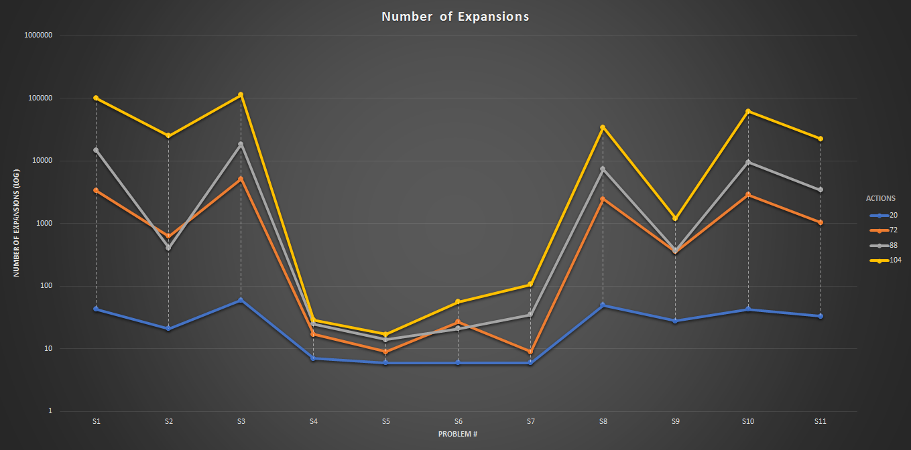
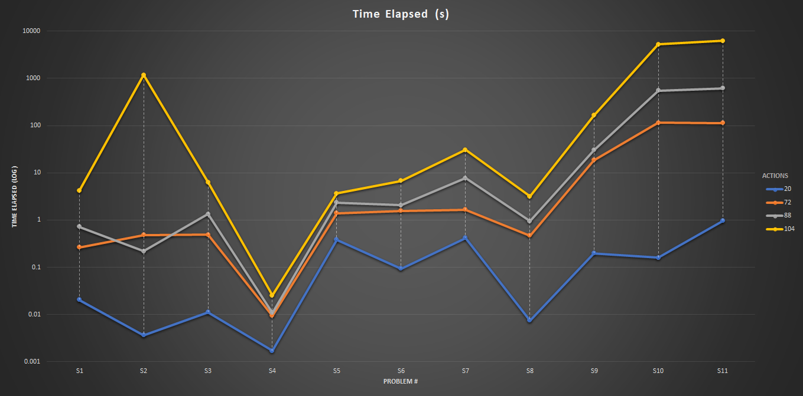
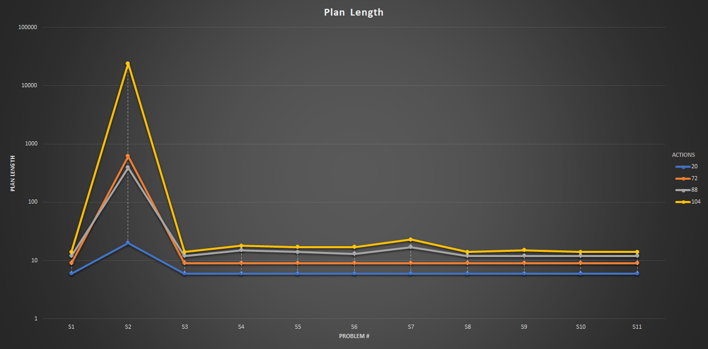

# Results

Find the pdf of this result in [`report.pdf`](report.pdf)

The file [`air_cargo_problems.py`](air_cargo_problems.py) consists of 4 problems to test the algorithms against.

The algorithms are:
- (S1) ... Breadth First Search/ BFS
- (S2) ... Depth First Graph Search
- (S3) ... Uniform Cost Search
- (S4) ... Greedy Best First Search Graph *(Unmet Goals)*
- (S5) ... Greedy Best First Search Graph *(PG Levelsum)*
- (S6) ... Greedy Best First Search Graph *(PG MaxLevel)*
- (S7) ... Greedy Best First Search Graph *(PG SetLevel)*
- (S8) ... A-Star Search *(Unmet Goals)*
- (S9) ... A-Star Search *(PG Levelsum)*
- (S10) ... A-Star Search *(PG MaxLevel)*
- (S11) ... A-Star Search *(PG SetLevel)*

Looking at the output files of each algorithm:

1. [`firstout.txt`](output/firstout.txt): Contains S1 - S10 of Problem 1
2. [`first11out.txt`](output/first11out.txt): Contains S11 of Problem 1
3. [`secondout.txt`](output/secondout.txt): Contains S1 - S10 of Problem 2
4. [`second11out.txt`](output/second11out.txt): Contains S11 of Problem 2
5. [`thirdout.txt`](output/thirdout.txt): Contains S1 - S10 of Problem 3
6. [`third11out.txt`](output/third11out.txt): Contains S11 of Problem 3
7. [`fourthout.txt`](output/fourthout.txt): Contains S1 - S10 of Problem 4
8. [`fourth11out.txt`](output/fourth11out.txt): Contains S11 of Problem 4

## Number of Expansions

The following table shows the number of nodes the Algorithms had to traverse to reach the Goal or solution.

| Problem# | S1    | S2    | S3     | S4  | S5  | S6  | S7  | S8    | S9   | S10   | S11   | Actions |
| :------- | ----- | ----- | ------ | --- | --- | --- | --- | ----- | ---- | ----- | ----- | ------: |
| P1       | 43    | 21    | 60     | 7   | 6   | 6   | 6   | 50    | 28   | 43    | 33    |      20 |
| P2       | 3343  | 624   | 5154   | 17  | 9   | 27  | 9   | 2467  | 357  | 2887  | 1037  |      72 |
| P3       | 14663 | 408   | 18510  | 25  | 14  | 21  | 35  | 7388  | 369  | 9580  | 3423  |      88 |
| P4       | 99736 | 25174 | 113339 | 29  | 17  | 56  | 107 | 34330 | 1208 | 62077 | 22606 |     104 |

Looking at the above table and graph, the **Greedy Best First Search** turns out to be consistent in finding the Goal state by traversing minimum number of nodes. And if we look closer, the **Unmet Goals (S4) and PG Levelsum (S5)** variants tends to be even more consistent and efficient.

The number of nodes for Greedy Best First Search vary linearly while other algorithms seems to vary exponentially.

## Time Elapsed

The following table show the amount of time it takes to run each algorithm in seconds.

| Problem# | S1    | S2    | S3    | S4    | S5    | S6    | S7    | S8    | S9    | S10   | S11   | Actions |
| :------- | ----- | ----- | ----- | ----- | ----- | ----- | ----- | ----- | ----- | ----- | ----- | ------: |
| P1       | 0.020 | 0.003 | 0.011 | 0.001 | 0.386 | 0.093 | 0.415 | 0.007 | 0.198 | 0.159 | 0.965 |      20 |
| P2       | 0.264 | 0.481 | 0.491 | 0.009 | 1.388 | 1.571 | 1.669 | 0.472 | 18.55 | 114.4 | 112.4 |      72 |
| P3       | 0.718 | 0.217 | 1.335 | 0.109 | 2.350 | 2.052 | 7.686 | 0.950 | 30.09 | 549.0 | 613.7 |      88 |
| P4       | 4.139 | 1174  | 6.326 | 0.025 | 3.670 | 6.752 | 30.45 | 3.172 | 163.5 | 5264  | 6219  |     104 |

Looking at the above table and graph, the **Greedy Best First Search** turns out to be consistent in finding the Goal state in minimum amount of time. And if we look closer, the **Unmet Goals (S4) and PG Levelsum (S5)** variants tends to be even more consistent and efficient.

The amount of time for Greedy Best First search vary quadratically while other algorithms seems to vary exponentially.

## Plan Length

The following table shows the length of output plan from each of the algorithms.

| Problem# | S1  | S2    | S3  | S4  | S5  | S6  | S7  | S8  | S9  | S10 | S11 | Actions |
| :------- | --- | ----- | --- | --- | --- | --- | --- | --- | --- | --- | --- | ------: |
| P1       | 6   | 20    | 6   | 6   | 6   | 6   | 6   | 6   | 6   | 6   | 6   |       6 |
| P2       | 9   | 619   | 9   | 9   | 9   | 9   | 9   | 9   | 9   | 9   | 9   |      72 |
| P3       | 12  | 392   | 12  | 15  | 14  | 13  | 17  | 12  | 12  | 12  | 12  |      88 |
| P4       | 14  | 24132 | 14  | 18  | 17  | 17  | 23  | 14  | 15  | 14  | 14  |     104 |

Looking at the above table and graph, **every algorithm, except Depth First Graph Search** turns out to be capable of finding the optimal Plan Length.

The length of plan for Depth First Graph search grows exponentially with the increasing size of problem but bounds to linear range for every other algorithm.
